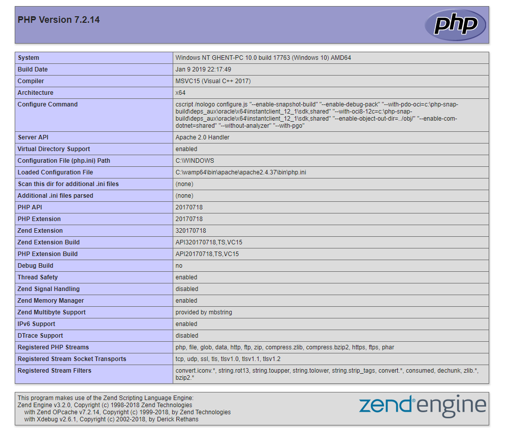

# LAMP Stack
PHP only functions when a server is present, so let's install a LAMP stack.
This is basically a:
- ***L*** inux 
- ***A*** pache 
- ***M*** ySQL 
- ***P*** HP Server.

To install this, follow [this](https://www.digitalocean.com/community/tutorials/how-to-install-linux-apache-mysql-php-lamp-stack-ubuntu-18-04) guide. 
If you choose to use anything else then the following options:
- **Ubuntu:** [LAMP](https://www.digitalocean.com/community/tutorials/how-to-install-linux-apache-mysql-php-lamp-stack-ubuntu-18-04) Stack
- **Windows:** [WAMP](http://www.wampserver.com/en/) Stack
- **Mac OS X:** Well, you can use [XAMPP](https://www.apachefriends.org/index.html) (propably your best option), but I don't provide support for Mac OS users.

Then I won't help you if you're stuck with issues pertaining to the server itself.

## Lamp Stack explained
### Apache
`Apache` is the engine (just like Nginx for other server types) that serves webpages in a dynamic way.
It allows us (amongst other things) to host the PHP service. 

### MySQL
`MySQL` is the database engine. It provides us with a backend hosted database, to which we can save data and pull from it.
Other variants exist, like:
- MongoDB
- NoSQL
- PostgreSQL
- ... 

### PHP
The `PHP` service reads and parses `PHP` into `html` for the browser.
Besides this, it also grants us a direct line to backend files and databases and a lot more...

## Extra installations
### PHP My Admin
PHP My Admin is a tool that gives us a graphical interface of the mysql databases on our pc.

[Here](https://www.digitalocean.com/community/tutorials/how-to-install-and-secure-phpmyadmin-on-ubuntu-18-04) is a guide on how to do it.
Again, if you use a different one, do it at your own risk ;)

## Done installing?
### Run your first php page

Okay now that that is done, head on over to the folder where your server has it's publically accessible files (usually the  `htdocs` / `httpdocs` / `public_html` / `www` folder) 
and create a php file called `index.php`.
All that needs to be in the file is:
`````
<?php phpinfo(); ?>
`````

Save that and then go to `localhost` in your browser to open the file.
This is what you should be seeing:


If this is what you are actually seeing, than congrats, you are up and running with your php server.
Next up is setting up phpmyadmin, try to do this on your own!
The [PHPMyAdmin guide](https://www.digitalocean.com/community/tutorials/how-to-install-and-secure-phpmyadmin-on-ubuntu-18-04) explains for the ubuntu users how to set it up and for windows and mac it should be pretty self-explanatory.

You reached the end ! Awesome !
You deserve a something, here you go
 


## Getting started

Here's some helpful spots to get you started:
- [Cloudways](https://www.cloudways.com/blog/how-to-start-php-programming/) explains the use of PHP nicely
- [Youtube](https://www.youtube.com/watch?v=ZdP0KM49IVk) can get you started with actual code pretty fast
- [W3Schools](https://www.w3schools.com/php/) has info on PHP as well
