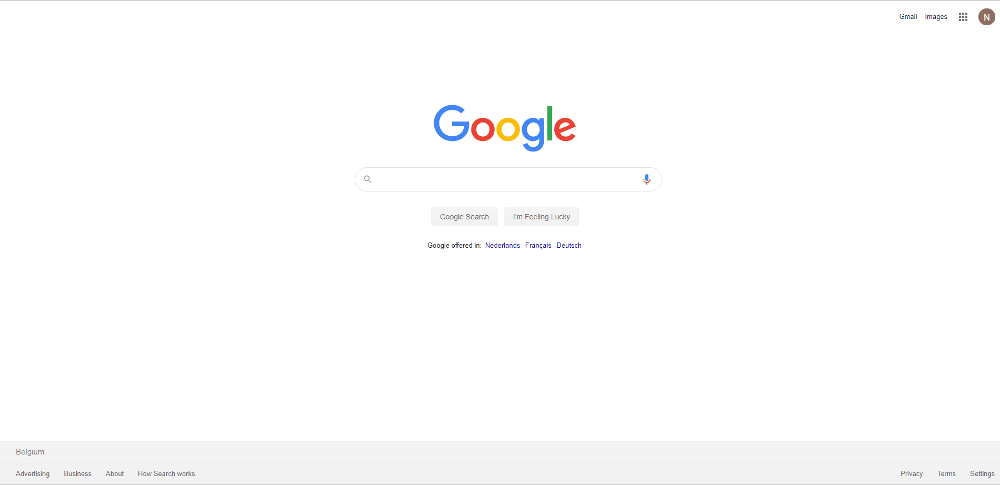
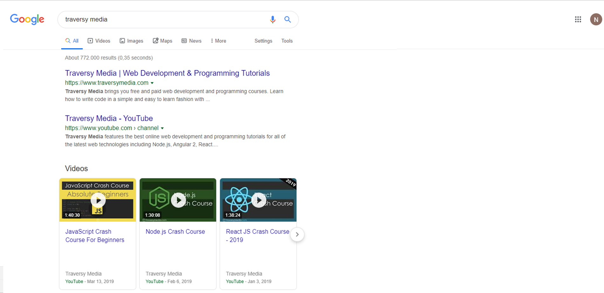

# Challenge: Goolge pages

|Challenge Parameters  |Challenge Details              |
|:---------------------|:------------------------------|
|Repository            |`google-pages`                 |
|Challenge type        |`optional challenge`           |
|Duration              |`N/A`                          |
|Deadline              |`N/A`                          |
|Deployment method     |`GitHub pages`                 |
|Group composition     |`solo`                         |

## Exercise

We all have seen it countless times, almost every single day, for you, approximately every 5 minutes.
But have you ever tried to replicate it? Probably not!
For this exercise, you will have to build 2 pages:
- The google search page.
- The google result page.

### Bonus:
- All the google result pages (Images, News, Videos, More).
- Go as far as you want!

If you know a little JavaScript, perhaps you could use the search bar, send the data inside the input to the result page and add the word, in each result.  
This way you can simulate a search result.

## Thanos challenge: (JavaScript)

This is something very advanced, but very impressive, if you manage to pull it off!  
Search for Thanos on google. On the right side of the result page, there is a small glove.  
Click on it.  
Recreate this animation effect.

## Goals

- [ ] Increasing your knowledge of HTML.
- [ ] Increasing your knowledge of CSS.
- [ ] Increasing your knowledge of flexbox.
- [ ] Increasing your knowledge of grid.
- [ ] Increasing your knowledge of JavaScript.

